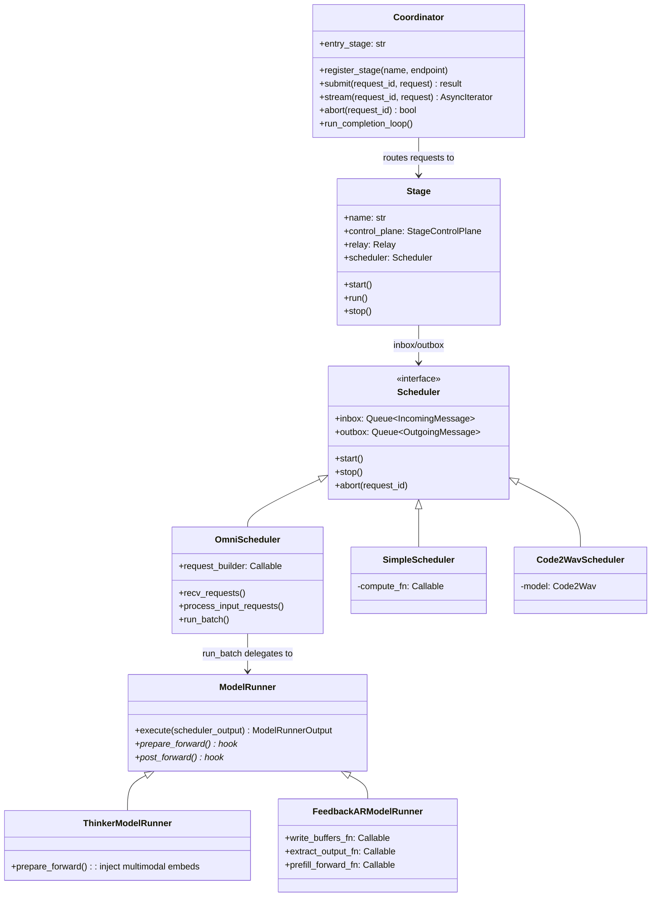
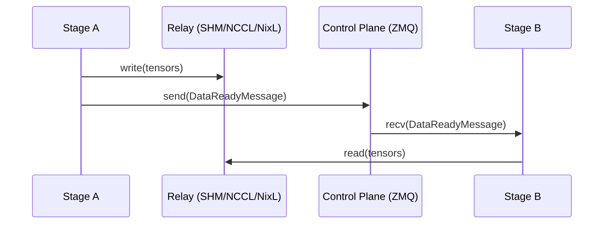
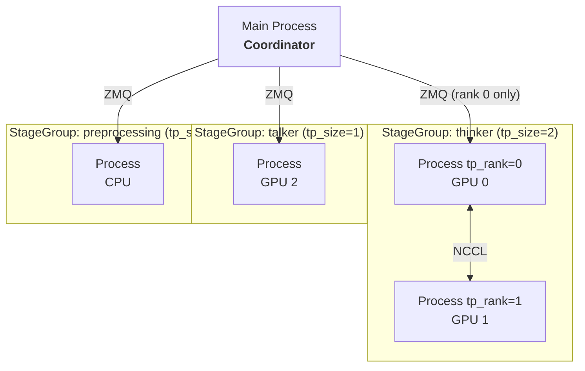
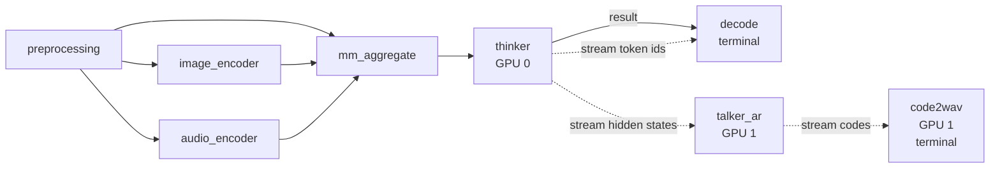
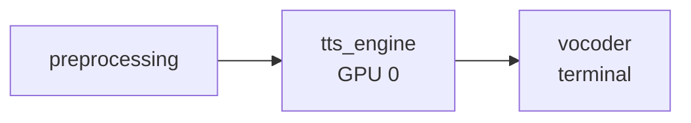
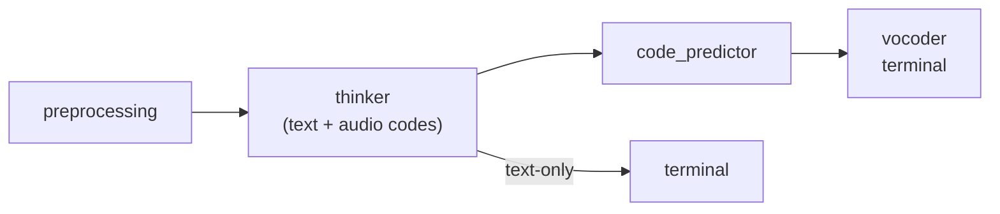
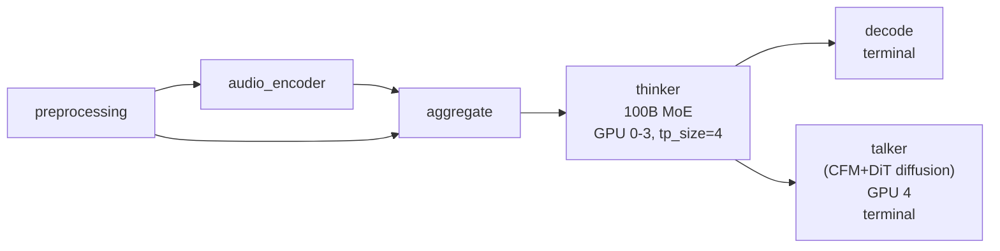

# SGLang Omni Refactor Tracking

---

Follows from [sglang#16546](https://github.com/sgl-project/sglang/issues/16546). Addresses problems in [#188](https://github.com/sgl-project/sglang-omni/issues/188).

## Architecture

### System Overview

```
HTTP API → Client → Coordinator → Stage → [Scheduler → ModelRunner → forward]
```

### Layer Responsibilities

| Layer           | Responsibility                                                                     | Model-aware? |
| --------------- | ---------------------------------------------------------------------------------- | ------------ |
| **Coordinator** | Request lifecycle, routing to entry stage, multi-terminal merge, abort broadcast   | No           |
| **Stage**       | IO shell — ZMQ control plane, relay data plane, fan-in aggregation, stream routing | No           |
| **Scheduler**   | Batch selection, KV cache management, compute dispatch                             | Partially    |
| **ModelRunner** | Forward pass, sampling, model-specific hooks                                       | Yes          |

### Directory Layout

```
sglang_omni/
├── pipeline/           # Inter-stage orchestration (model-agnostic)
├── scheduling/         # Scheduling loops (OmniScheduler, SimpleScheduler)
├── model_runner/       # Model runner base + shared FeedbackARModelRunner
├── models/             # Model definitions + pipeline configs
├── config/             # Pipeline config schema + compiler
├── relay/              # Data transfer backends (SHM, NCCL, NixL)
├── serve/              # HTTP server, OpenAI API
├── client/             # Client library
└── proto/              # Message types
```

### Class Diagram



> **Note (Chenyang):** HTTP API → Client is currently lost from the original lifecycle diagram and should be added back to the system overview. @Huapeng

> **Note (Chenyang):** Please add the WebSocket here. @huapeng

> **Note (Yichi):** nit: ModelRunner hook can be illustrated more clearly in the overview (e.g. by splitting into prepare_prefill/decode and post_prefill/decode rather than generic prepare/post_forward). Since they have different behavior on thinker and talker, and it is important enough to demonstrate in the graph.

> **Note (Yichi):** Also, "Client" section doesn't seem to be appear in the doc, should we add it as well?

> **【TODO: Huapeng make up https design layer】**

---

## Pipeline Layer

### HTTP/Websocket

HTTP and websocket is sglang omni's request endpoint which exposes to the outside, as user we can get the response we want via these endpoint.

- **HTTP:**
  - `POST /v1/chat/completions`
  - `POST /v1/audio/speech`
  - `GET /v1/models`
  - `GET /health`
- **WebSocket:**
  - `WS /v1/realtime`

For the difference between http and websocket, you can think it's like when you chat, you use messages or phone call, one is request and get, one is duplex communication. PR ref

### Client

Client is like the adapter between http/websocket and coordinator, it's like the real implementation of endpoint.

Like the `/speech`, it refines the input calls the generate and return the refined output.

Code part:

```python
async for chunk in self.generate(request, request_id=request_id):
    if chunk.audio_data is not None:
        audio_chunks.append(chunk.audio_data)
    if chunk.sample_rate is not None:
        sample_rate = chunk.sample_rate
    last_chunk = chunk
```

### Coordinator

Global request router. Tracks the request lifecycle across stages.

1. Routes new requests to the entry stage
2. Collects completions from terminal stages
3. Merges results when multiple terminal stages exist (e.g., `decode` + `code2wav`)
4. Broadcasts abort to all stages

### Stage

IO shell. Every stage has one scheduler (no branching). Handles all inter-stage communication.

```python
class Stage:
    def __init__(self, name, control_plane, relay, route_fn,
                 input_handler, scheduler, stream_targets, same_gpu_targets):
        self.scheduler = scheduler  # always present
```

Responsibilities:

- **Control plane (ZMQ):** receive `SubmitMessage`, `DataReadyMessage`, `AbortMessage`
- **Data plane (Relay):** read/write tensors between stages via SHM/NCCL/NixL
- **Input aggregation:** wait for multiple upstream stages before dispatching (`AggregatedInput`)
- **Stream routing:** receive/send streaming chunks (hidden states, codec codes)
- **Dispatch:** push all messages into `scheduler.inbox`, drain `scheduler.outbox`

One code path. Stage never checks scheduler type.

### Inter-Stage Communication



- **Control plane (ZMQ):** small messages — Submit, DataReady, Abort, Shutdown. PUB/SUB for abort broadcast, PUSH/PULL for point-to-point.
- **Data plane (Relay):** large tensors. Pluggable backends: SHM (single machine), NCCL (multi-GPU), NixL (RDMA multi-node), Mooncake. Same-GPU stages use CUDA IPC zero-copy automatically.
- **Streaming:** hidden states / codec codes flow via `DataReadyMessage` with `chunk_id` and `is_done` fields, parallel to normal result routing.

> **Note (Chenyang):** The split between control and data planes is core: ZMQ carries small coordination messages (`SubmitMessage`, `DataReadyMessage`, `AbortMessage`), while the relay (SHM/NCCL/NIXL/Mooncake) carries the actual tensors.

> The thinker→talker relationship is fundamentally producer-consumer — thinker produces hidden states / text tokens, talker consumes them and produces audio codes. This is structurally the same pattern as RL training (e.g., actor produces trajectories, learner consumes them), where Ray is the dominant orchestration layer. So a first-principles question: should we consider Ray for the inter-stage scheduling layer instead of hand-rolling ZMQ + relay? (Jingwen) As discussed, not adding it for now due to heaviness of Ray.

### `relay_io` Utility Module

Utility module providing:

- **User-facing API**
  - `write_payload` / `read_payload` — full `StagePayload` serialization via relay
  - `send_stream_chunk` — handles same-GPU IPC vs cross-GPU relay, NIXL credit deadlock avoidance
- **Internal facing-API**
  - `write_blob` / `read_blob` — raw tensor transfer for streaming chunks
  - `extract_tensors` / `restore_tensors` — recursive tensor extraction from nested dicts

> **Note (Chenyang):** (Solved)
>
> 1. API layering. `write_payload` / `read_payload` and `send_stream_chunk` are the user-facing APIs that stages actually call. `write_blob` / `read_blob` and `extract_tensors` / `restore_tensors` are internal building blocks — the former gets wrapped by `send_stream_chunk` for cross-GPU transfer, the latter gets used inside `write_payload` / `read_payload` to pull tensors out of nested dicts.
> 2. Asymmetric stream API. There is no `recv_stream_chunk`. Only `send_stream_chunk` exists because the sender has real decisions to make (same-GPU IPC vs cross-GPU relay, NIXL credit management), while the receiver just calls `read_blob` from the stage's main message loop — wrapping a one-liner into `recv_stream_chunk` would add a layer without adding any value.

---

## Scheduling Layer

All schedulers share the same interface: `inbox`, `outbox`, `start()`, `stop()`, `abort()`.

### OmniScheduler — Composition with SGLang


For AR stages. Subset of SGLang Scheduler — reuses `get_next_batch_to_run()`, `run_batch()`, `process_batch_result()`, `event_loop_normal()`, overlap scheduling.

- **Reused from SGLang:** `get_next_batch_to_run()`, `process_batch_result()`, `self_check_during_idle()` — KV cache management, prefill/decode scheduling, tree cache, dLLM support
- **Overridden:** `init` (skip ZMQ/tokenizer/metrics), `recv_requests()` (drain inbox, route stream chunks to per-request state), `process_input_requests()` (`request_builder` conversion), `run_batch()` (delegate to ModelRunner), `send_to_tokenizer()` (no-op)
- **Not used from SGLang:** ZMQ channels, tokenizer init, grammar backend, metrics exporter, disaggregation, LoRA, speculative decoding, PP, watchdog

Runs in a dedicated thread. Stage communicates via thread-safe queues.

> **Note (Chenyang):** Should we separately discuss `ThinkerScheduler` and `CodePredictorScheduler`? Their KV cache is quite different. `CodePredictor` is put under Talker.
>
> Composition with SGLang's Scheduler is reasonable, but we should pin down the boundary now to avoid the kind of upgrade pain SGLang RL forks have hit repeatedly.
>
> Four points:
>
> 1. **Pin or track?** Tracking SGLang main fits the same-umbrella relationship, but only if CI runs against the real Scheduler, not mocks. Otherwise pin. (now it's a pin. It's too expensive currently to track)
> 2. **Minimize reuse surface.** Use PrefillManager and DecodeManager as black boxes — public methods only, no reads or writes of internal attributes. The moment we touch internals, composition becomes a de facto fork.
> 3. **Upstream-first.** When OmniScheduler needs something SGLang doesn't cleanly expose, push a hook or factored-out method into SGLang main rather than patching downstream. The RFC already notes SGLang needs a clean-based Scheduler — contributing to that is directly in our interest. (too expensive for now, will try to do in the future)

> **Note (Chenyang):**
> The same OOM behaves differently across models today: S2-Pro and Voxtral return HTTP 500 (correct), Ming-Omni returns HTTP 200 with `waveform=None` (silent failure), Qwen3-Omni returns HTTP 200 with a zero tensor (worst — looks like a valid waveform downstream). The first two work correctly only because they did nothing; the latter two fail because a broad `except Exception` in the executor swallowed the error. Under the current architecture, writing less code is writing more correct code — that's not a healthy signal, and every new model integration has to rediscover error handling from scratch.
>
> This refactor should fix it at the Scheduler layer: (Jingwen: pr #449)
>
> 1. **Unified catch in `run_batch()`** — Scheduler wraps forward, catches exceptions, marks request failed, propagates via outbox → Coordinator → HTTP 500 for non-streaming. For streaming responses, HTTP headers are already flushed before the first chunk, so HTTP 500 cannot fire mid-stream — instead, successful streams must terminate with an explicit completion sentinel frame, and failed streams abort the connection before emitting it. Absent sentinel + premature close is the client-side failure signal.
> 2. **Model executors forbidden from writing `except Exception`** — model-side code is pure functional, doesn't own lifecycle, exceptions propagate naturally. Specific expected exceptions must catch specific types, never base `Exception`. Must be enforced via lint rule, not review discipline: rule 1's catch is path-local to `run_batch()`, so a broad catch in `add_request` or embed-load paths (e.g. `_load_thinker_embedding_rows`' per-shard catch) slips past it. Lint is the only mechanism that closes that gap.
> 3. **Fallbacks architecturally disallowed** — executor either succeeds or hands off to Scheduler. No third path returning a "fake success" indistinguishable from a real result. Concrete violations to clean up at enforcement time include `_generate_speech` returning `(None, 44100, 0.0)`.
> 4. **CI fault injection** — inject OOM and verify the correct failure signal per model: HTTP 500 for non-streaming, sentinel-absent + premature close for streaming. Detection-only by nature, so it complements but does not substitute for rule 2's lint enforcement.
>
> Short-term bridge fix (#302) should land as-is without an `is_oom_error()` helper, since that helper becomes dead code once the Scheduler-layer catch lands.

> **【TODO: chenyang, I pinged my comment in#449】**

### SimpleScheduler

For non-AR stages (preprocessing, encoders, aggregate, decode). No KV cache, no batching. Just `inbox.get()` → `fn(data)` → `outbox.put()`. Supports inbox/outbox and basic forward operation; batched processing supported where useful.

### Code2WavScheduler

Streaming vocoder. Handles:

- `new_request` → init
- `stream_chunk` → accumulate + decode
- `stream_done` → flush + output

### Message Types

```python
class IncomingMessage:
    request_id: str
    type: "new_request" | "stream_chunk" | "stream_done"
    data: Any

class OutgoingMessage:
    request_id: str
    type: "result" | "stream"
    data: Any
    target: str | None  # for stream: downstream stage name
```

---

## Model Runner + Callbacks

```
ForwardBatch → prepare_forward() → forward() → post_forward() → sample() → ModelRunnerOutput
                    ↑ hook                          ↑ hook
```

| Runner                    | Used by                | Hook behavior                                                        |
| ------------------------- | ---------------------- | -------------------------------------------------------------------- |
| **ThinkerModelRunner**    | Qwen3 / Ming thinker   | prepare_forward: inject multimodal embeddings                        |
| **FeedbackARModelRunner** | Qwen3 talker, Fish TTS | 3 callbacks: write_buffers_fn, extract_output_fn, prefill_forward_fn |

> **Note (Chenyang):** Open question — with the current design, can we treat CUDA Graph and `torch.compile` as class-sharable rather than configured model by model? (Jingwen) Yes, currently it's intentionally designed to be so (that's why such modelrunner abstraction exists, but special model has special cases).

> DiffusionModelRunner is no longer speculative — Ming-Omni (#236) requires it, and image-gen diffusion is functionally working. Should be added as a first-class runner type alongside `ThinkerModelRunner` and `FeedbackARModelRunner` later.

### `ModelRunner` (Base)

Shared execute pipeline for all AR models.

```python
class ModelRunner:
    def execute(self, scheduler_output):
        forward_batch = ForwardBatch.init_new(...)
        batch_result = self.prepare_forward(...)  # hook
        if batch_result is None:
            batch_result = self.tp_worker.forward_batch_generation(forward_batch)
        self.post_forward(batch_result, ...)       # hook
        # sample, logit processing, output extraction
        return ModelRunnerOutput(...)
```

Shared: `ForwardBatch` construction, sampling, repetition penalty, codec suppression, output processing.

> **Note (Chenyang):** The earlier `prepare_forward` / `if batch_result is None` block was misleading — `prepare_forward` was doing two unrelated things (mutating the batch and short-circuiting to a custom forward result). The version above splits those into `before_forward` (always mutates in place) and an explicit `custom_forward` branch, which makes the prefill-with-injection path (Fish TTS) honest instead of disguising it as "the hook returned a value." My suggestions are:

```python
def execute(self, scheduler_output):
    forward_batch = ForwardBatch.init_new(...)

    # Mutate forward_batch in place (e.g. inject multimodal embeds).
    self.before_forward(forward_batch, ...)

    # Two mutually exclusive paths:
    #   - custom_forward: model-specific forward (e.g. Fish TTS prefill
    #     with VQ embedding injection).
    #   - default forward: standard tp_worker.forward_batch_generation.
    if self.has_custom_forward:
        forward_output = self.custom_forward(forward_batch, ...)
    else:
        forward_output = self.tp_worker.forward_batch_generation(forward_batch)

    self.post_forward(forward_output, ...)
    return ModelRunnerOutput(...)
```

> **【TODO: Jingwen, have we done this part】**

### `ThinkerModelRunner`

Injects multimodal embeddings (image / video / audio) + deepstack before forward.

```python
class ThinkerModelRunner(ModelRunner):
    def prepare_forward(self, ...):
        # Inject multimodal embeds into forward_batch
        ...
```

### `FeedbackARModelRunner`

Shared model runner for all AR + codebook models (Qwen3 talker, Fish TTS, future models). The model's `forward()` handles backbone + secondary head internally. This runner writes / reads model buffers around forward.

```python
class FeedbackARModelRunner(ModelRunner):
    def __init__(self, tp_worker, output_processor, outbox, *,
                 write_buffers_fn, extract_output_fn, prefill_forward_fn=None):
        ...

    def prepare_forward(self, ...):
        if decode:
            self._write_buffers(model, schedule_batch, requests)
        elif prefill and self._prefill_forward:
            return self._prefill_forward(tp_worker, forward_batch, ...)
        return None

    def post_forward(self, ...):
        self._extract_output(model, schedule_batch, requests, outbox)
```

Model-specific behavior via three callbacks:

- `write_buffers_fn`: write previous step's feedback into model buffers
- `extract_output_fn`: read codes / feedback from model after forward
- `prefill_forward_fn`: custom forward for prefill (optional)

> **Note (Chenyang):**
>
> One design point on the callback pattern in `FeedbackARModelRunner` — currently each model provides three bare functions (`write_buffers_fn`, `extract_output_fn`, `prefill_forward_fn`) that get passed in individually. This works, but the three functions are semantically coupled (they all operate on the same model's buffers) and there's nothing at the type level enforcing that coupling.
>
> A lightweight improvement: collect them into a Strategy object.

```python
class FeedbackStrategy(Protocol):
    def write_buffers(self, model, schedule_batch, requests) -> None: ...
    def extract_output(self, model, schedule_batch, requests, outbox) -> None: ...
    def prefill_forward(self, tp_worker, forward_batch, ...) -> Optional[BatchResult]: ...

class QwenTalkerStrategy:
    def write_buffers(self, model, schedule_batch, requests):
        # feedback_embeds + trailing/pad → model._feedback_buffer
    def extract_output(self, model, schedule_batch, requests, outbox):
        # model._output_codes → outbox, _output_embeds → feedback
    def prefill_forward(self, tp_worker, forward_batch, ...):
        # projected input_embeds prefill

class FishTTSStrategy:
    def write_buffers(self, ...): ...
    def extract_output(self, ...): ...
    def prefill_forward(self, ...): ...
```

> Also, the current design groups S2 Pro (Slow AR + Fast AR) and Qwen3-Omni (Talker + MTP) under the same `FeedbackARModelRunner`. This works because in both cases, the feedback producer and receiver live inside the same ModelRunner — the loop is self-contained within one decode step.
>
> Worth making this assumption explicit in the RFC: `FeedbackARModelRunner` covers AR models whose feedback loop is self-contained within a single ModelRunner instance. Cross-stage feedback (producer and receiver in separate schedulers, communicating via relay) is out of scope for this abstraction and would need a different design. This isn't a problem today — both models fit the self-contained shape — but documenting the boundary now prevents future contributors from trying to bend the abstraction to cover topologies it wasn't designed for.

> **【TODO: Jingwen, have we done this part】**

### Callback Pattern

Each model provides a `callbacks.py` with three functions:

**Qwen3 Talker** — `models/qwen3_omni/callbacks.py`:

1. `write_talker_buffers`: `feedback_embeds` + trailing/pad → `model._feedback_buffer`
2. `extract_talker_output`: `model._output_codes` → outbox, `_output_embeds` → feedback
3. `talker_prefill_forward`: projected `input_embeds` prefill

**Fish TTS** — `models/fishaudio_s2_pro/callbacks.py`:

1. `write_fish_buffers`: codebook values → `model._vq_codes`
2. `extract_fish_output`: `model._output_codes` → per-request output
3. `fish_prefill_forward`: VQ embedding injection into `input_embeds`

Adding a third model = write a new `callbacks.py` with three functions.

### Model.forward(): One Decode Step (AR + Codebook)

Both Qwen3 talker and Fish TTS follow the same internal pattern:

1. Read previous step's feedback from model buffers (written by `FeedbackARModelRunner`)
2. AR backbone → hidden states → logits
3. Sample first code from logits
4. Secondary head predicts remaining codebook layers autoregressively
5. Store combined output → buffers for next step
6. Output: multi-layer codes + feedback

The model class handles steps 1–6 inside `forward()`. `FeedbackARModelRunner` handles writing (before) and reading (after).

---

## Model Directory Convention

Every model follows the same file structure:

```
models/<model_name>/
├── config.py              — Pipeline config (stage definitions, GPU placement)
├── stages.py              — Stage factories (returns callable or OmniScheduler)
├── routing.py             — Stage routing functions (which stage follows which)
├── request_builders.py    — Inter-stage data transform (build engine requests)
├── payload_types.py       — Model-specific pipeline state
├── callbacks.py           — FeedbackARModelRunner callbacks
├── __init__.py
└── components/            — Model-specific torch modules, preprocessors, encoders
```

> **Note (Chenyang):** Tend not to over-abstract. `routing.py` and `request_builders.py` could plausibly be merged into one file — both describe the data-shape contract between consecutive stages, and splitting them across two files just adds navigation cost. (Jingwen) Request builder is a model-specific component for model requiring special format of input, such as qwen3-omni thinker-talker.

### Qwen3-Omni

```
models/qwen3_omni/
├── config.py              — 8-stage speech, 6-stage text
├── stages.py              — 8 factories
├── routing.py             — 8 routing functions
├── request_builders.py    — build thinker/talker/encoder requests
├── payload_types.py       — PipelineState, OmniEvent, ThinkerOutput
├── callbacks.py           — write_talker_buffers, extract_talker_output, talker_prefill_forward
├── hf_config.py           — HF config classes
├── merge.py               — Merge 3 encoder outputs for thinker
├── components/
│   ├── thinker.py         — Model loader/wrapper (Qwen3OmniSplitThinker)
│   ├── thinker_model.py   — SGLang thinker model definition
│   ├── talker.py          — SGLang talker model (fused MTP)
│   ├── preprocessor.py    — Tokenize, load media, apply HF processor
│   ├── image_encoder.py   — Image tower
│   ├── audio_encoder.py   — Audio tower
│   ├── talker_input.py    — Build talker prefill
│   ├── streaming_detokenizer.py — Streaming text detokenizer scheduler
│   ├── code2wav_scheduler.py — Vocoder streaming scheduler
│   └── common.py          — Shared helpers
```

Speech pipeline (8 stages): `preprocessing → image_encoder → audio_encoder → aggregate → thinker → decode → talker → code2wav`

> **Note (Chenyang):**
>
> 1. `PipelineState` and `OmniEvent` are ambiguous names — both sound like they belong to the framework, but they're model-specific. Rename later. **【TODO: Jingwen, have we done this part】**
> 2. "Image tower" / "Audio tower" — why "tower"? Inherited terminology from VLM literature. Worth aligning on either "encoder" or "tower" consistently rather than mixing. Jingwen: this is followed the name from official qwen3-omni.
> 3. `image_encoder` → `audio_encoder` should run in parallel, not sequentially as the arrow chain might suggest. There should also be design space for offloading them to CPU. Jingwen: Changed.

### Fish Audio S2-Pro

```
models/fishaudio_s2_pro/
├── config.py              — 3-stage TTS
├── stages.py              — 3 factories
├── routing.py             — 3 routing functions
├── request_builders.py    — build_sglang_tts_request, apply_tts_result
├── payload_types.py       — S2ProState
├── callbacks.py           — write_fish_buffers, extract_fish_output, fish_prefill_forward
├── sglang_model.py        — SGLang model registration
├── tokenizer.py           — Tokenizer wrapper
└── fish_speech/           — Model definitions (text2semantic, DAC codec)
```

Pipeline (3 stages): `preprocessing → tts_engine → vocoder`

---

## Declarative Config

### Example

```python
stages = [
    StageConfig(name="preprocessing",
                factory="...create_preprocessing_executor",
                route_fn="...routing.preprocessing_next"),

    StageConfig(name="image_encoder",
                factory="...create_image_encoder_executor",
                gpu=0, next="mm_aggregate"),

    StageConfig(name="mm_aggregate",
                factory="...create_aggregate_executor",
                wait_for=["preprocessing", "image_encoder", "audio_encoder"],
                merge_fn="...merge_for_thinker",
                next="thinker"),

    StageConfig(name="thinker",
                factory="...create_thinker_executor",
                factory_args={"speech_enabled": True},
                gpu=0, next=["decode", "talker_ar"],
                stream_to=["talker_ar", "decode"]),

    StageConfig(name="decode", factory="...create_decode", terminal=True),

    StageConfig(name="code2wav", factory="...create_code2wav", gpu=1, terminal=True),
]
```

> **Note (Huapeng):** I feel realtime is needed supporting streaming in, an important feature for voice agent. https://vllm.ai/blog/streaming-realtime Do we need to consider more? We will do this in https://github.com/sgl-project/sglang-omni/pull/385

> **Note(Huapeng):** /realtime feature, for low latency voice agent and realtime transcription and translation, if we accept streaming input, it can get better results and be useful in daily usecase. I think sglang omni might need to implement this and implement features in openai's realtime interface, https://developers.openai.com/api/docs/guides/realtime This will unlock voice model's potential for real use case, like https://x.com/OpenAIDevs/status/2048871260512473385?s=20. For implement this, we get a streaming audio in, at the same time, the inference engine can receive the chunk and send the SSE back via websocket. We can reference some implementation in https://vllm.ai/blog/streaming-realtime and https://github.com/sgl-project/sglang/issues/22474#issuecomment-4241744895. Detailed plan is TBD.

> **Note (Chenyang):**
> **Runtime parameter plumbing.** Critical params (`mem_fraction_static`, `thinker_max_seq_len`, soon `video_fps`) are either hardcoded deep in the stack or routed through ad-hoc overrides nobody fully understands. CLI / config-file / override paths don't compose, and every new param reinvents its own precedence resolution. The refactor needs one canonical mechanism: a typed, stage-addressable override primitive at the `PipelineConfig` layer, with CLI / config / env as thin adapters on top. All runtime params go through it. As a related symmetry gap, length validation today only guards the thinker input side; talker also needs an output-length cap, otherwise an unbounded decode loop (missed stop token, hallucination loop) hits OOM or tail latency the same way. Both should route through the same plumbing once it exists.
>
> **Stage placement — co-location as first-class.** Two issues here, both informed by Ratish's vLLM-Omni investigation:
>
> 1. Stages must be allowed to share GPUs. vLLM co-locates thinker + talker on one device via per-stage memory budgeting + NVML accounting. We currently hard-reject same-GPU speech-stage placement, which leaves Talker on H200 at <2% utilization long-term. The placement model must treat "any stage on any GPU" as first-class, with budgeting that accounts for co-tenants rather than rejecting the topology. (Done)
> 2. Pick one memory-fraction semantics deliberately. vLLM's `gpu_memory_utilization` is fraction of total VRAM. SGLang's `mem_fraction_static` is fraction of remaining VRAM after weights load — more principled for single-stage LLM, but ambiguous for omni where stages load sequentially and "remaining" depends on load order. Either keep SGLang semantics with a careful sequential-allocation model, or switch to vLLM's total-VRAM semantics. Don't inherit the current ambiguity. (Done)

### `StageConfig` reference

| Field        | Type             | Default    | Description                                                                        |
| ------------ | ---------------- | ---------- | ---------------------------------------------------------------------------------- |
| name         | str              | _required_ | Unique stage identifier                                                            |
| factory      | str              | _required_ | Dotted import path to factory function                                             |
| factory_args | dict             | {}         | Args forwarded to factory (model_path, gpu_id auto-injected)                       |
| next         | str \| list[str] | None       | Static routing: downstream stage(s). Replaces routing functions for most stages    |
| route_fn     | str              | None       | Dynamic routing: dotted path to fn(request_id, output) → str \| list[str] \| None  |
| terminal     | bool             | FALSE      | Terminal stage — no downstream. Coordinator collects the result here               |
| gpu          | int \| list[int] | None       | GPU id(s). None = CPU stage. List for TP (one GPU per rank)                        |
| tp_size      | int              | 1          | Tensor parallelism ranks. Must match len(gpu) if gpu is a list                     |
| wait_for     | list[str]        | None       | Fan-in: wait for these upstream stages before dispatching                          |
| merge_fn     | str              | None       | Dotted path to fn(dict[str, StagePayload]) -> StagePayload. Required with wait_for |
| stream_to    | list[str]        | []         | Stream hidden states / codes to these stages (parallel to normal routing)          |
| relay        | RelayConfig      | None       | Override relay settings. Auto-inferred from gpu if not set                         |

**Routing rule:** exactly one of `next`, `route_fn`, or `terminal=True`.

Derived from stages: `entry_stage` (first stage), `terminal_stages`, `gpu_placement`, relay device.

> **Note (Chenyang):**
>
> 1. There is no "one thinker, multiple talkers" case. Talker decode requires the thinker's hidden state as prefix, and driving two independent talkers from the same prefix has no business meaning.
> 2. More broadly, `route_fn` has limited utility: Qwen3-Omni and Fish S2 Pro are fully covered by `next` + `stream_to`, and it's only needed when the hidden state itself carries a modality tag and the downstream branch must be decided from the data (e.g. Ming, where the output if/else's into a video or audio head). Given the narrow use case, the contract should stay narrow — return value must be a stage already declared in `next` (so topology stays statically derivable), `None` return should be disallowed (drops belong in an explicit terminal sink, not hidden in routing), and the docstring should restrict use to data-driven modality dispatch. One field, narrow contract, easy to widen later when a real consumer shows up.
> 3. Should we merge `factory_args` and `factory` into one field?

### `PipelineConfig` reference

Derived (computed from stages, not set manually): `terminal_stages`, `gpu_placement`.

> **Note (Chenyang):** The `Pipeline` vs `Stages` distinction in code needs to be sharper. Right now both names show up in different places without a crisp mental model — pin this down before the field set grows.

> **Note (Chenyang):** Open question — do we need a compiler class, or is an `init` function per model's pipeline enough? The current proposal leans toward "compiler" as a concept; I think a plain init function per pipeline is likely sufficient given how few pipelines we maintain. (compile-pipeline deleted #447)

> **Note (Yichi):** `compiler_pipeline()` is described as the compilation entry point, but the multi-process path (`mp_runner._build_stage_groups`) re-implements most of the same logic independently. And two paths share some private helpers but each has its own `_resolve_factory_args` with nearly identical code. --> would suggest at least set clear boundary on responsibility of each class, either let compiler class be single compilation entry point, or discard compiler class. Jingwen: (fixed, #447)

---

## Multi-Process Runner

```
pipeline/
├── stage_process.py    # StageProcessSpec (picklable) + subprocess entrypoint
├── stage_group.py      # StageGroup — manages N processes per stage
└── mp_runner.py        # MultiProcessRunner — orchestrates all groups
```



> **Note (Chenyang):** `stage_group.py` and `stage_process.py` are tightly coupled — `StageGroup` is the only consumer of `StageProcessSpec`, the subprocess entrypoint is ~40 lines, and the spec is a small dataclass. None of the three justifies its own file. Merging into a single `stage_workers.py` keeps everything about "how a stage's processes get defined, spawned, and managed" in one place, and leaves `mp_runner.py` focused on cross-stage orchestration. Two files, cleaner ownership.

> **【TODO: Jingwen, have we merged these files】**

### `StageProcessSpec`

A fully-resolved, picklable dataclass built once in the main process. Subprocesses never re-compile the pipeline config — they just construct a `Stage` from the spec and run it.

> **Note (Chenyang):** "Spec" is too vague a class name. Rename to `StageLaunchConfig`.

The main process resolves all dotted strings, injects `model_path` / `gpu_id` into factory args, allocates ZMQ endpoints, and computes stream targets and relay config. The spec captures everything the child process needs.

The subprocess entrypoint (`stage_process_main`) is ~40 lines: import factory, call it, build routing callable from `route_fn` or `next_stages`, build input handler from `wait_for` / `merge_fn`, construct `Stage`, run.

> **Note (Chenyang):** Promoting `tp_size` to a top-level field treats TP as special, but it's just one parallelism axis. Qwen3-Omni's Thinker is MoE and could want EP; throughput-oriented stages might want DP across replicas. If we add those later, we'll end up with `tp_size` / `ep_size` / `dp_size` proliferating at the top level. Cleaner to group them under a single `parallelism: ParallelismConfig` field now — `ParallelismConfig(tp=N)` reads as clearly as `tp_size=N` and leaves room to add `ep`, `dp` without further schema churn. If the intent is TP-only for the foreseeable future, at least document that explicitly so readers don't assume other strategies were deliberately excluded. (maybe we should add this as we get more parallelism and not now, or the class will only have tp attribute, increasing visual burden)

### `StageGroup`

Manages the lifecycle (spawn, `wait_ready`, shutdown, health monitoring) of all OS processes backing one logical stage. For `tp_size == 1` (default), one process. For `tp_size > 1`, spawns one process per TP rank with appropriate `tp_rank` / `gpu_id`.

### `MultiProcessRunner`

Orchestrates startup across all `StageGroup`s. `_build_stage_groups(config)` turns a `PipelineConfig` into `list[StageGroup]` by iterating over stages, resolving factory args, allocating endpoints, and building one `StageProcessSpec` per TP rank per stage. The Coordinator runs in the main process and only talks to rank 0 of each group.

### Tensor Parallelism Support

TP within a stage is orthogonal to pipeline parallelism between stages. The `StageGroup` spawns `tp_size` processes per AR stage. Each process runs a full `OmniScheduler` + `ModelWorker` with a different `tp_rank` and `gpu_id`. NCCL collectives inside the model forward keep TP ranks in lockstep. The Coordinator is TP-unaware — it only talks to rank 0 of each group.

Within a TP group, rank 0 receives from the control plane and broadcasts to peer ranks. All ranks make identical scheduling decisions. Only rank 0 sends results downstream. Each stage gets its own NCCL port (`_NcclPortAllocator` in `mp_runner.py`).

Declaring TP in a stage:

```python
StageConfig(name="thinker", factory="...", gpu=[0, 1, 2, 3], tp_size=4)
```

`StageGroup` spawns 4 processes. NCCL collectives inside the model forward keep them in lockstep. The coordinator only talks to rank 0. Each stage gets its own NCCL port.

---

## Supported Pipelines

### Qwen3-Omni (8-stage speech)



- `result`: from decode (terminal)
- `stream token ids`: thinker → decode
- `stream hidden states`: thinker → talker_ar
- `stream codes`: talker_ar → code2wav

Thinker streams hidden states to talker while simultaneously outputting text. Coordinator merges both terminals.

### Fish Audio S2-Pro (3-stage TTS)



### MiMo-Audio ([#249](https://github.com/sgl-project/sglang-omni/issues/249)) — planned



4-stage, single GPU. Thinker generates text + audio codes in one pass. No new abstractions needed.

### Ming-Omni ([#236](https://github.com/sgl-project/sglang-omni/issues/236)) — planned



---

## Adding a New Model

1. Create `models/<name>/config.py` — `PipelineConfig` subclass with stage definitions (routing, GPU placement, fan-in all inline via `next` / `wait_for` / `gpu`)
2. Create `models/<name>/stages.py` — factory per stage (return callable for `SimpleScheduler`, or `OmniScheduler` for AR)
3. Create `models/<name>/callbacks.py` — if AR + codebook: three functions for `FeedbackARModelRunner`
4. Create `models/<name>/components/` — model definitions, preprocessor, encoders
5. (Optional) Create `models/<name>/routing.py` — only if a stage needs dynamic routing (`route_fn`)

Everything else (`Stage`, `Coordinator`, `OmniScheduler`, `ModelRunner`, relay, compiler, mp_runner) is reused as-is.

---

## tp_size

---

## Progress Tracking

[PR #334](https://github.com/sgl-project/sglang-omni/pull/334) — V1 pipeline is still being debugged to pass all CIs.

Following the suggestion in [#188 (comment)](https://github.com/sgl-project/sglang-omni/issues/188#issuecomment-4161198732), we should also track how many files need to be touched and the upper bound of the cost of integrating a new model. Boson's upcoming model will serve as the first concrete data point.
